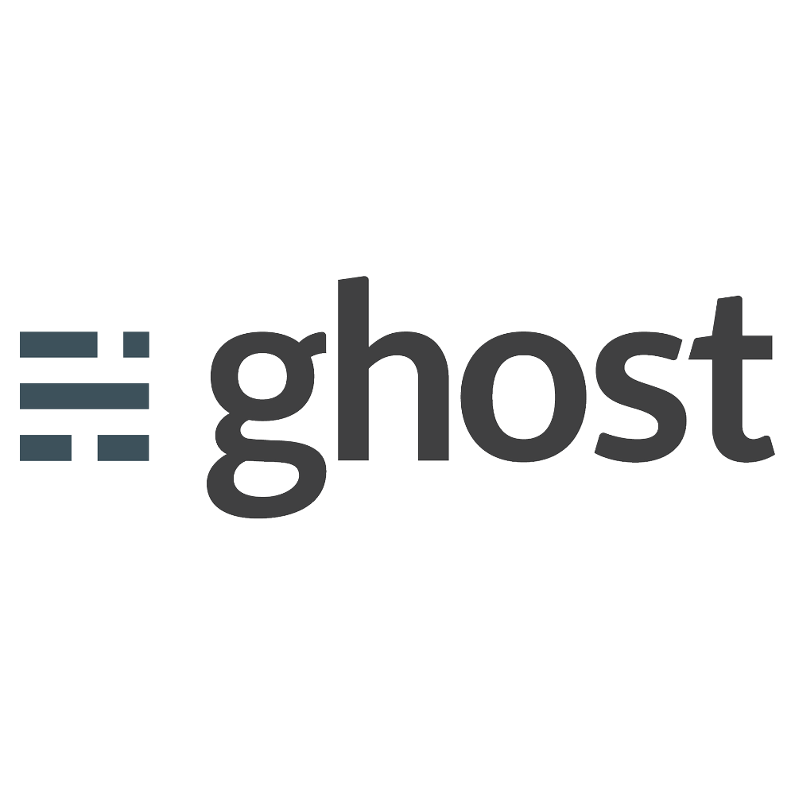

### 👋 Howdy!, I'm Karel "[Bastakka][website]" Bašta 🇨🇿

## ⭐ I'm an university student looking for fun!
- 🎓 Graduated [Purkyňka](http://www.sspbrno.cz/) high school
- 🎓 Attending [MENDELU](https://mendelu.cz/) university

### 🔌 Connect with me
[][website]
[][linkedin]
[][github]
[][facebook]
[][instagram]
[][twitter]
[][reddit]
[][youtube]
[][twitch]
 

### 😎 Familiar with:

 

  

### 📕 Latest Blog Posts
<!-- BLOG-POST-LIST:START -->
- [Škola, Shibuya a... Arkády?](https://bastakka.eu/skola-shibuya-a-arkady/)
- [Cesta do země vycházejícího slunce ☀️](https://bastakka.eu/cesta-do-zeme-vychazejiciho-slunce/)
- [Japonsko se blíží... Vlastně spíše já](https://bastakka.eu/japonsko-se-blizi/)
- [Tahle animovaná postavička dělá živé vysílání kde?](https://bastakka.eu/tahle-animovana-postavicka-dela-zive-vysilani-kde/)
- [Mé pracovní prostředí](https://bastakka.eu/me-pracovni-prostredi/)
<!-- BLOG-POST-LIST:END -->
➡️ [More blog posts...][website]

  
:zap: GitHub Stats

  

[website]: https://bastakka.eu
[linkedin]: https://www.linkedin.com/in/bastakka/
[github]: https://github.com/bastakka
[facebook]: https://www.facebook.com/bastakkafb
[instagram]: https://www.instagram.com/bastakkaig
[twitter]: https://twitter.com/bastakka
[reddit]: https://www.reddit.com/user/bastakka
[youtube]: https://www.youtube.com/channel/UChBXqs7ltOK4BCjWV8FU8NA
[twitch]: https://www.twitch.tv/bastakka
